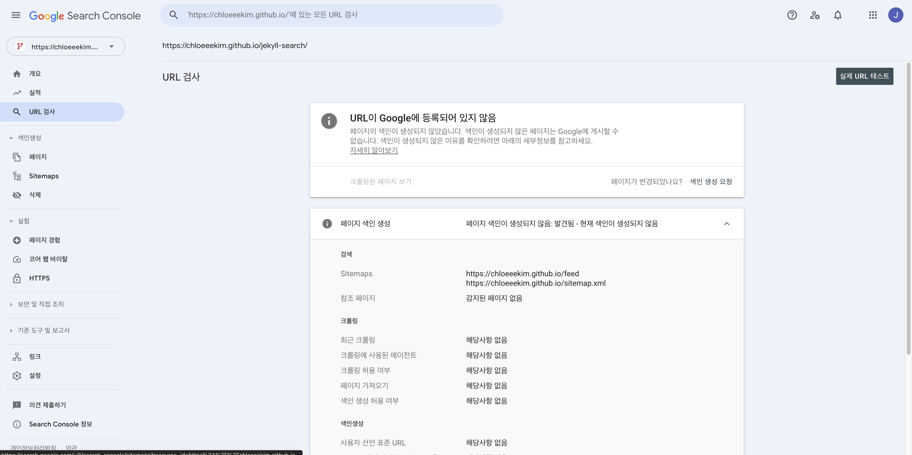

## Table of contents

이 블로그는 2024년부터 Jekyll과 GitHub Pages로 굴러가고 있었다. Mediumish 테마에 jQuery, lunr.js 검색, kramdown. 딱히 불만은 없었다.

옮긴 계기는 취향이 아니라 배포였다. 워크플로우가 `ruby/setup-ruby`를 SHA로 v1.161.0에 고정해두고 있었는데, 러너 이미지가 바뀌자 배포가 통째로 실패했다. 글 하나 고치려면 먼저 빌드 환경을 고쳐야 하는 상태였다. Ruby 버전과 gem 의존성을 다시 맞추는 대신 Node 기반으로 옮기기로 했다.

옮기면서 스스로에게 준 제약은 하나였다. **URL을 하나도 바꾸지 않는다.** 4년치 글이 검색으로 유입되고 있고, 글 안에서 서로를 링크하고 있고, 외부에서 걸어둔 링크도 있다. 프레임워크를 바꾸는 건 내 사정이지 독자 사정이 아니다.

# 무엇이 무엇으로 대체되는가

Jekyll 쪽 `_config.yml`에 있던 플러그인부터 대응표를 만들었다. 이게 없으면 "그러고 보니 사이트맵이 없네"를 배포 후에 발견한다.

| Jekyll | Astro |
| --- | --- |
| jekyll-feed (`/feed.xml`) | `@astrojs/rss` (`/rss.xml`) |
| jekyll-sitemap | `@astrojs/sitemap` |
| jekyll-seo-tag | 레이아웃에서 직접 메타 태그 |
| jekyll-paginate (`/page:num/`) | `paginate()` (`/posts/[...page]`) |
| jekyll-archives (`/category/:name/`) | `/tags/[tag]`, `/archives` |
| kramdown + rouge | remark + Shiki |
| lunr.js + jQuery | Pagefind |
| jekyll-admin | 없음 (안 쓰고 있었다) |

테마는 [0xdres/astro-devosfera](https://github.com/0xdres/astro-devosfera)(MIT)를 골랐다. Astro v6 기반이고, 콘텐츠 컬렉션과 OG 이미지 생성이 이미 붙어 있었다.

마이그레이션 중에는 Jekyll 파일과 Astro 파일이 한 저장소에 공존한다. `_layouts`와 `assets`의 옛 스크립트가 `astro check`에 잡히니 `tsconfig`에서 임시로 제외해두고, 다 옮긴 뒤에 되돌렸다.

# URL을 유지하는 데 든 것

## 퍼머링크

Jekyll의 `permalink: /:title/`은 글 URL이 `/python-class/`처럼 루트 바로 아래에 온다는 뜻이다. 테마 기본값은 `/posts/python-class/`였다.

라우트 파일을 옮기고 경로 생성 함수에서 접두어를 없앴다.

```txt
src/pages/posts/[...slug]/index.astro  ->  src/pages/[...slug]/index.astro
```

```ts
// src/utils/getPath.ts
// Jekyll 시절 퍼머링크 /:title/ 를 유지하기 위해 `/posts` 접두어를 붙이지 않는다.
export function getPath(id: string, filePath: string | undefined) {
```

목록 페이지 `/posts`는 그대로 뒀다. 글 상세만 루트로 올라온 구조다.

여기에 딸려오는 제약이 하나 있다. 콘텐츠 디렉터리에 하위 폴더를 만들면 그 이름이 URL에 붙는다. Jekyll에서는 `_posts/Jekyll/`, `_posts/Programming/`으로 나눠뒀지만 퍼머링크에는 카테고리가 안 들어갔다. 그래서 처음에는 **28편을 하위 디렉터리 없이 평면으로** 뒀다. 분류는 `tags`에 맡기고.

## 분류와 퍼머링크를 같이 가져가기

평면 배치는 글이 늘면 불편하다. 그런데 `getPath`를 다시 읽어보니 필요한 게 이미 있었다.

```ts
.filter(path => !path.startsWith("_")) // exclude directories start with underscore "_"
```

**밑줄로 시작하는 디렉터리는 경로에서 빠진다.** 테마가 넣어둔 필터인데, 이걸 쓰면 디렉터리로 분류하면서 URL은 루트로 유지할 수 있다. 태그를 기준으로 셋으로 나눴다.

```txt
src/data/blog/
├── _blog/     -> /jekyll-search/
├── _claude/   -> /claude-writing-rules/
└── _cuda/     -> /cudaEvent/
```

디렉터리 이름은 URL에 안 나타난다. `dist`에 `_cuda` 같은 디렉터리도 생기지 않는다. 글 파일이 밑줄로 시작하면 `**/[^_]*.{md,mdx}` 패턴에서 아예 제외되니, 밑줄은 **디렉터리에만** 붙여야 한다.

옮기고 나서 빌드가 깨졌다. `ImageNotFound`. 경로가 한 단계 깊어지면서 본문의 상대 이미지 경로가 어긋난 것이다.

```diff
- 
+ 
```

이미지를 `public/`에 두고 절대 경로로 쓰던 시절에는 없던 제약이다. `src/`로 옮겨 최적화를 받는 대신, 본문이 **자기 파일 위치에 묶이게** 됐다. 옮긴 10편에서 `../../`를 `../../../`로 고쳤다. 디렉터리를 재편할 때마다 따라오는 비용이라, 깊이를 더 파지 않는 편이 낫다.

## 피드 주소

`jekyll-feed`는 `/feed.xml`을 제공한다. RSS 구독자의 링크를 깨뜨릴 이유가 없어서 별칭 라우트를 하나 뒀다.

```ts
// src/pages/feed.xml.ts
// Jekyll 의 jekyll-feed 가 제공하던 /feed.xml 주소를 유지하기 위한 별칭.
// 신규 노출(head 의 rel="alternate")은 /rss.xml 을 정본으로 쓴다.
export { GET } from "./rss.xml";
```

네 줄이다. 내용은 `/rss.xml`과 같고, `head`의 자동 검색만 `/rss.xml`을 정본으로 둔다. 구 주소는 살아 있고 신규 구독은 새 주소로 간다.

## 유입 통계

GA4 측정 ID를 새로 만들지 않고 Jekyll에서 쓰던 `G-5DB4C9PFP7`을 그대로 연결했다. 프레임워크가 바뀌었다고 통계가 끊기면 마이그레이션 전후를 비교할 수가 없다. Jekyll 템플릿과 마찬가지로 프로덕션 빌드에서만 스크립트를 넣는다.

# 프론트매터 변환

28편의 프론트매터를 콘텐츠 컬렉션 스키마에 맞게 바꿨다.

```yaml
# Jekyll
layout: post
title: "Github pages와 Jekyll 설치하기 - Windows ver."
author: chloeeekim
categories: [Jekyll]
image: assets/images/jekyll-setup-windows/title.png
featured: true
toc: true
```

```yaml
# Astro
title: "Github pages와 Jekyll 설치하기 - Windows ver."
description: "Windows 환경에서 GitHub Pages 저장소를 만들고 Ruby와 Jekyll을 설치해 블로그를 띄우기까지의 과정."
pubDatetime: 2024-06-26T09:00:00+09:00
author: "Chloe Jungah Kim"
tags:
  - jekyll
featured: true
draft: false
```

| 항목 | 처리 |
| --- | --- |
| `layout` | 삭제. 라우트가 결정한다 |
| `categories: [Jekyll]` | `tags`로, 소문자로 |
| 파일명의 날짜 | `pubDatetime`에 KST(`+09:00`)로 |
| `image` | 제외. 커버 이미지를 쓰지 않기로 했다 |
| `toc: true` | 본문 맨 앞에 `## Table of contents` 한 줄 |
| `description` | 28편 모두 새로 작성 |

손이 많이 간 건 `description`이다. Jekyll에서는 없으면 없는 대로 넘어갔지만 스키마 필수값이라 **없으면 빌드가 실패한다.** 처음엔 귀찮았는데, 목록 카드와 검색 결과, SEO 메타에 그대로 쓰이는 문장이라 결국 있어야 하는 값이었다. 스키마가 강제해준 쪽이 나았다.

날짜는 Jekyll에서 파일명이 들고 있었다(`2024-06-26-jekyll-setup-windows.md`). Astro에서는 파일명이 슬러그라 날짜를 떼어내고 프론트매터로 옮겼다. 파일명에서 날짜를 지우는 순간 URL이 바뀌므로, 순서를 헷갈리면 안 되는 지점이다.

# 대문자 슬러그가 404를 냈다

배포하고 나서 `/cudaEvent/`가 404였다. 홈에서 그 글을 클릭하면 잘 열린다. 예전 주소로 직접 들어가면 없다.

## 왜 바뀌었나

`glob` 로더는 파일 경로에서 엔트리의 id를 만든다. 기본 구현은 경로를 세그먼트 단위로 쪼개 각각 `github-slugger`에 넣는데, 여기서 **대문자가 소문자로 내려간다.**

```txt
cudaEvent.md  ->  id: "cudaevent"  ->  /cudaevent/
```

Jekyll의 `permalink: /:title/`은 파일명을 손대지 않는다. 그래서 4년 동안 `/cudaEvent/`로 색인되고 링크돼 있었다. 옮기는 쪽에서 규칙이 하나 더 끼어들었을 뿐인데 주소가 갈렸다.

내부 링크가 멀쩡했던 이유도 여기에 있다. 이 블로그의 글 경로는 전부 `getPath(post.id, post.filePath)` 한 곳에서 나온다.

| 사용처 | 무엇 |
| --- | --- |
| `src/pages/[...slug]/index.astro` | 글 상세 라우트 |
| `src/pages/[...slug]/index.png.ts` | OG 이미지 |
| `contentEntry.ts` | 목록 카드, 태그, 아카이브, RSS |
| `PostDetails.astro` | 이전/다음 글 링크 |

id가 `cudaevent`로 바뀌면 **라우트와 링크가 같이 바뀐다.** 사이트 안에서는 아무것도 깨지지 않는다. 깨지는 건 사이트 밖에 있는 옛 주소뿐이고, 그래서 클릭해서 돌아다니는 검수로는 안 걸린다.

## 선택지 세 개

세 가지를 놓고 봤다.

**파일명을 `cudaevent.md`로 바꾸고 주소를 포기한다.** 제일 쉽다. 그리고 이번 마이그레이션의 유일한 제약을 어긴다. 검색 유입이 있는 글이라 탈락.

**리다이렉트를 붙인다.** 정적 출력에서 Astro의 `redirects`는 meta refresh HTML을 뱉는다. GitHub Pages에는 서버 측 301이 없으니 이게 최선인데, 대소문자만 다른 주소 때문에 유령 페이지를 하나 만드는 셈이다. 원래 주소를 그대로 살릴 수 있는데 굳이 우회할 이유가 없었다.

**프론트매터에 `slug`를 적는다.** 기본 `generateId`는 프론트매터의 `slug`가 있으면 그걸 먼저 쓴다. 스키마 검증 전의 원본 데이터를 보기 때문에 스키마에 필드를 추가하지 않아도 동작한다.

```yaml
slug: cudaEvent
```

한 줄로 끝나긴 하는데, 이건 **그 글만 고친다.** 다음에 대문자 섞인 파일을 만들면 같은 사고가 다시 난다. 그리고 "파일명이 곧 URL"이라는 규칙에 예외를 하나 만든다.

## 택한 것

로더 차원에서 규칙 자체를 바꿨다. 파일명에서 확장자만 떼고 그대로 id로 쓴다.

```ts
// src/content.config.ts
loader: glob({
  pattern: "**/[^_]*.{md,mdx}",
  base: `./${BLOG_PATH}`,
  // 기본 generateId 는 id 를 소문자로 만든다. Jekyll 시절 /cudaEvent/ 처럼
  // 대문자가 섞인 퍼머링크가 있어 파일명을 그대로 슬러그로 쓴다.
  generateId: ({ entry }) => entry.replace(/\.(md|mdx)$/, ""),
}),
```

한 줄이지만 성격이 다르다. 예외를 만드는 게 아니라 **Jekyll이 쓰던 규칙(파일명 = URL)을 Astro에 옮겨 심는 것**이다. 28편에 전부 같은 규칙이 걸리고, 앞으로 쓰는 글에도 걸린다.

대가는 안전망이 없어지는 것이다. 슬러그화가 안 끼어드니 파일명이 이상하면 주소가 그대로 이상해진다. 공백이나 한글을 넣으면 인코딩된 URL이 나간다. 규칙을 README에 한 줄로 못박아뒀다.

> `src/data/blog/`에 마크다운 파일을 만든다. **파일명이 곧 URL**이다.

규칙이 걸리는 건 파일명뿐이다. 디렉터리 세그먼트는 `getPath`에서 여전히 슬러그화되는데, 지금 쓰는 밑줄 디렉터리는 경로에서 통째로 빠지니 해당되지 않는다. 밑줄 없는 폴더를 만들면 그때는 폴더명이 소문자로 내려간다.

## 로컬 검수는 이걸 통과시켰다

변환 직후에도 28편을 대조하긴 했다. 글 파일명으로 빌드 산출물에 페이지가 생겼는지 확인하는 루프였다.

```bash
for f in src/data/blog/*.md; do
  slug=$(basename "$f" .md)
  [ -f "dist/$slug/index.html" ] || echo "!! $slug MISSING"
done
```

결과는 28 / 28, 누락 없음이었다. 그리고 배포된 사이트에서 `/cudaEvent/`는 404였다.

이유는 파일시스템이다. macOS의 APFS는 기본적으로 **대소문자를 구분하지 않는다.** 실제로 만들어진 디렉터리는 `dist/cudaevent`인데, `[ -f "dist/cudaEvent/index.html" ]`이 참을 반환한다. GitHub Pages가 서비스하는 리눅스는 구분한다. 로컬에서 초록불이고 배포에서 404가 나는 조합이 이렇게 만들어진다.

**대소문자 문제를 로컬 파일 존재 검사로 잡으려는 시도는 처음부터 성립하지 않는다.** 이건 검수를 꼼꼼히 해서 될 문제가 아니라 도구를 바꿔야 하는 문제다.

## 실제로 확인한 방법

배포된 주소에 직접 요청하는 것으로 시작했다. 파일시스템을 안 거치니 대소문자가 그대로 살아 있다.

```bash
for u in cudaEvent cudaevent; do
  printf "  /%s/ -> %s\n" "$u" "$(curl -sL -o /dev/null -w '%{http_code}' https://chloeeekim.github.io/$u/)"
done
```

```txt
  /cudaEvent/ -> 404
  /cudaevent/ -> 200
```

이걸로 증상이 확정됐다. 다음은 나머지 27편이었다. 비교할 옛 주소 목록이 필요한데, `_site`는 Jekyll 파일을 정리할 때 이미 지운 상태였다.

목록은 git에 있었다. 이 저장소는 예전에 **`_site`를 저장소에 커밋하고 있었다.** 마이그레이션을 시작하면서 `.gitignore`에 넣고 트래킹을 끊었지만, 끊기 전 커밋에는 218개 파일이 그대로 남아 있다. 빌드 산출물을 커밋하는 건 보통 지적받는 습관인데, 이번에는 그게 **4년치 URL 대장** 역할을 했다.

```bash
git ls-tree -r --name-only <_site 가 트래킹되던 마지막 커밋> | grep -E '^_site/[^/]+/index\.html$'
```

`_site/<이름>/index.html` 패턴에서 `<이름>`을 뽑으면 그게 그날 서비스되던 URL이다. 여기에 `_site/cudaEvent/index.html`이 대문자로 박혀 있었다.

그 다음은 집합 세 개를 비교하는 파이썬 스크립트를 돌렸다. 앞의 루프처럼 경로를 찍어서 있는지 묻는 대신, **양쪽의 실제 이름을 모아 놓고 비교한다.** 찍어서 묻는 방식은 파일시스템이 대소문자를 뭉개주지만, 목록을 받아 비교하면 저장된 이름이 그대로 온다.

| 집합 | 출처 |
| --- | --- |
| 옛 URL | `git ls-tree`로 뽑은 `_site/*/index.html` |
| 새 URL | `dist`의 디렉터리 이름 |
| 글 슬러그 | `src/data/blog`의 파일명 |

```txt
생성 누락: 0 []
구 사이트에 없던 슬러그: 0 []
구 URL 과 정확히 일치: 28 / 28
```

세 줄을 따로 뽑은 이유가 있다. "누락 0"은 새 사이트에 페이지가 다 있다는 뜻이고, "구 사이트에 없던 슬러그 0"은 **주소가 바뀐 글이 없다**는 뜻이다. 앞의 로컬 루프는 첫 번째만 봤고, 정작 필요한 건 두 번째였다.

# 이미지

본문에서 참조하는 이미지는 47개였다. 결과부터 적으면, **경로를 유지하려던 첫 판단이 틀렸다.** 세 단계를 거쳐 되돌렸다.

## 1단계: 경로를 그대로 유지한다

Jekyll에서 `/assets/images/...`로 절대 경로 참조였기 때문에, `public/assets/images/`로 옮기면 경로가 그대로다. 본문은 한 글자도 안 고쳤다.

```txt
assets/images/jekyll-search/1.jpg  ->  public/assets/images/jekyll-search/1.jpg
```

커버 이미지(`title.*`)와 구 테마 전용 이미지는 쓰지 않으므로 뺐다.

## 2단계: 손으로 WebP로 변환한다

옮긴 뒤에 WebP로 변환했다. 6.23MB에서 1.67MB로 73% 줄었다. 스크린샷이 대부분이라 글자가 뭉개지면 쓸모가 없으니 **PNG는 무손실, JPG는 품질 82**로 갈랐다. 확장자가 바뀌니 본문의 ``도 12편에서 함께 갱신했다.

여기서 만족하고 넘어갔는데, 실은 Astro의 이미지 처리를 하나도 안 쓰고 있었다.

## 3단계: src로 옮긴다

`public/`의 파일은 Astro가 **처리하지 않고 그대로 복사만 한다.** 여기에 본문도 원시 ``였다. 위치와 문법 두 조건이 모두 어긋나 있었다. `astro.config.ts`에는 `image.layout` 설정이 이미 들어 있었지만, 본문 이미지 중 최적화를 받는 건 한 장도 없었다.

이미지를 `src/assets/images/`로 옮기고 본문을 마크다운 문법으로 바꿨다.

```markdown

```

빌드 결과가 이렇게 바뀐다.

```html

```

`srcset`이 640w부터 원본 너비까지 여섯 단계로 생성되고, `loading="lazy"`와 `decoding="async"`가 기본으로 붙는다. 덤으로 `width`/`height`가 들어가서 **이미지가 로드될 때 본문이 밀리던 것도 사라졌다.** 이전에는 치수가 없어 브라우저가 자리를 미리 잡을 수 없었다.

## 소스는 WebP가 아니라 원본을 넣었다

옮길 때 2단계에서 만든 WebP를 그대로 쓰지 않고, **변환 전 원본 JPG/PNG를 git 이력에서 복원해서** 넣었다.

이미 손실 압축된 WebP를 소스로 주면 Astro가 다시 인코딩한다. 손실이 두 번 얹힌다. 원본에서 한 번만 인코딩하는 쪽이 화질도 낫고 용량도 낫다. 기본 `src` 합계가 1642KB에서 1545KB로 **오히려 줄었고**, 여기에 좁은 화면용 640w 변형이 덤으로 생긴다.

복원한 blob은 이미 저장소 이력에 있으니 용량이 늘지도 않는다. 손으로 변환한 2단계는 결국 버린 작업이 됐지만, 버리는 게 맞는 작업이었다.

About 페이지의 아바타는 한 박자 뒤에 옮겼다. `public/`에 남아 최적화를 못 받던 마지막 이미지였는데, 110px 자리에 460x460 원본을 그대로 내려보내고 있었다.

경로가 `SITE.about.avatar` 설정값이라 정적 `import`를 쓸 수 없다. `import.meta.glob`으로 `src/assets/images` 최상위를 미리 읽어두고 경로로 찾는 방식을 썼다. 크기가 110px로 고정이라 전역 설정인 `constrained` 대신 `layout="fixed"`로 1x와 2x 두 벌만 굽는다. 25,166B 한 벌이 3,236B와 8,350B로 갈렸다.

여기서 걸린 것이 하나 있다. `densities`와 `layout`은 배타적인 유니온이라 함께 못 쓴다. 둘을 같이 주면 `astro check`가 `layout`은 `never` 타입이라고 잡는다.

이제 `public/`에 본문 이미지가 없다.

## 여기서 배운 것

"URL을 바꾸지 않는다"는 제약을 **이미지 경로에까지 적용한 게 실수였다.** 글 주소는 검색 결과와 외부 링크가 걸려 있으니 지켜야 한다. 본문 이미지 경로는 HTML 안에서만 쓰이고, 바뀌어도 독자가 밟는 링크가 아니다. 지킬 이유가 없는 것을 지키느라 프레임워크가 해주는 일을 손으로 하고 있었다.

제약을 세울 때는 **그게 걸리는 범위도 같이 정해야 한다.** "URL"이 글 주소를 말하는지 사이트가 내보내는 모든 경로를 말하는지 구분하지 않으면, 이렇게 두 번 일한다.

# 본문에 박혀 있던 raw HTML

이미지를 마크다운 문법으로 바꾸고 나니 옛 글에 두 종류가 더 남아 있었다. 10편에 걸쳐 외부 링크 `<a href="..." target="_blank">` 14곳과, 안내 배너로 쓰던 `<div>` 7곳이다.

```html
<div style="text-align: center; color: red;">
※ 이 글은 2013년도에 작성된 글입니다. <br>사진이나 세부적인 내용은 지금과 다를 수 있습니다.<br><br>
</div>
```

렌더링은 되니 급한 문제는 아니었다. 그런데 이게 왜 박혀 있었는지를 보면 그냥 지울 수가 없다.

## 마크다운으로 표현할 수 없는 것

`<a>`가 남아 있던 이유는 단순하다. **마크다운 링크 문법에는 `target`과 `rel`을 적을 자리가 없다.** 새 탭으로 열려면 HTML을 직접 쓰는 것 말고 방법이 없었다. 마크다운으로 바꾸는 순간 새 탭 동작이 사라진다.

본문에서 표현할 수 없으면 본문 밖에서 정하면 된다. 마크다운이 HTML로 바뀐 뒤의 트리를 건드리는 단계가 rehype다.

| 단계 | 다루는 것 |
| --- | --- |
| remark | 마크다운 AST. 목차 생성(`remark-toc`) 같은 일 |
| rehype | HTML AST. `a` 태그에 속성을 붙이는 일 |

`a` 태그는 마크다운 단계에는 아직 존재하지 않는다. 그래서 이건 rehype에서 할 일이다.

```ts
// astro.config.ts
markdown: {
  remarkPlugins: [remarkToc, [remarkCollapse, { test: "Table of contents" }]],
  // 본문은 마크다운 링크만 쓰고, 외부 링크의 새 탭/rel 은 여기서 붙인다
  rehypePlugins: [rehypeExternalLinks],
},
```

규칙은 한 줄이다. 호스트가 사이트와 다르면 외부로 본다.

```ts
if (host && host !== siteHost) {
  node.properties.target = "_blank";
  node.properties.rel = "noopener noreferrer";
}
```

`rehype-external-links` 패키지가 같은 일을 한다. 규칙이 이 한 줄뿐이라 의존성을 늘리지 않고 직접 뒀다. 코드 블록 파일명을 붙이는 Shiki transformer를 직접 둔 것과 같은 판단이다.

## 걷어내면서 오히려 나아진 것

옮기고 보니 예전 `<a>`에 없던 게 붙었다. `rel="noopener"`다. 새 탭으로 열린 페이지가 `window.opener`로 원래 페이지를 조작하지 못하게 막는다. 손으로 쓰던 시절에는 링크마다 적어야 해서 빠져 있었는데, 한 곳에서 붙이니 전부에 걸린다.

**규칙을 한 곳으로 모으면 빠뜨릴 자리가 없어진다.** 이게 본문에서 HTML을 걷어낸 진짜 소득이다.

자기 블로그를 절대 URL로 가리키던 링크 2곳은 상대 경로로 바꿨다. 내부 링크라 새 탭으로 열 이유가 없고, 도메인이 바뀌어도 안 깨진다.

```diff
- <a href="https://chloeeekim.github.io/jekyll-google-analytics/" target="_blank">이전 포스팅</a>
+ [이전 포스팅](/jekyll-google-analytics/)
```

배너 `<div>`는 인용문으로 바꿨다.

```markdown
> ※ 이 글은 2013년도에 작성된 글입니다.
> 사진이나 세부적인 내용은 지금과 다를 수 있습니다.
```

하드코딩된 빨강이라 다크 모드를 타지 못하고 배경과 대비도 나빴다. 인용문으로 두면 `typography.css`의 blockquote 스타일을 받아 테마를 따라간다.

## 순서

플러그인을 먼저 넣고, 그 다음 커밋에서 본문을 바꿨다. 반대로 하면 본문을 마크다운으로 바꾼 시점부터 플러그인이 들어올 때까지 새 탭 동작이 끊긴다. 커밋 두 개짜리 작업이라 별것 아닌 것 같지만, **동작을 옮길 때는 받을 쪽을 먼저 놓아야 한다.**

빌드 결과로 확인했다. 본문의 외부 링크 전부에 `target`과 `rel`이 붙었고, 자기 도메인을 절대 URL로 가리키는 링크와 `color: red`는 0건이다. 소스 16편에 raw HTML 잔재가 없다.

# 검색

lunr.js는 2977줄짜리 스크립트를 클라이언트로 내려보내고 jQuery에 얹혀 있었다. Pagefind로 바꿨다. 색인을 빌드 시점에 만들고 검색할 때 필요한 조각만 가져온다.

```json
"build": "astro check && astro build && pagefind --site dist && cp -r dist/pagefind public/"
```

마지막 `cp`가 필요하다. Pagefind 색인은 빌드 산출물에서 생성되므로 `astro dev`에는 없다. 한 번 빌드해서 `public/pagefind/`에 복사해두면 개발 서버에서도 검색이 동작한다.

기본 UI를 사이트 톤에 맞추는 데 시간을 좀 썼다. 기억해둘 만한 건 두 가지다. Pagefind 기본 UI는 입력창 높이를 `padding`이 아니라 `height`(64px)로 정한다. `padding`만 덮어써도 높이가 안 바뀐다. 그리고 돋보기 아이콘 규칙이 클래스 두 개(`.pagefind-ui__form.svelte-xxx::before`)라 클래스 하나로 쓴 내 선택자는 명시도에서 져서 **적용된 적이 없었다.** 64px일 때는 기본값 `top: 23px`가 우연히 중앙이라 드러나지 않았고, 높이를 줄이자 드러났다.

# 테마에서 남의 흔적 걷어내기

남의 테마로 시작하면 내 것이 아닌 문구와 코드가 곳곳에 남는다. 이걸 따로 한 단계로 잡아두는 편이 낫다. 나눠서 발견하면 계속 새로 나온다.

- 홈 히어로, 푸터, 목록/검색 페이지 문구가 테마 작성자의 것이었다
- 아카이브 페이지의 월 이름과 "año/años"가 스페인어로 남아 있었다. 태그 페이지에는 "contenido"
- About 페이지가 테마 작성자 소개글이었다
- 안 쓰는 기능: 갤러리 라우트와 컬렉션, 인트로 오디오 플레이어, 데모 콘텐츠

갤러리는 두 단계로 걷었다. 라우트와 데모 데이터를 먼저 지우고, 컬렉션과 컴포넌트 분기는 타입에 얽혀 있어 나중에 정리했다. 데이터 디렉터리가 없는 컬렉션을 참조한 채로 두면 개발 서버 기동 때마다 glob 로더 경고가 뜬다.

폰트는 예상 못 한 지점이었다. 테마 본문 폰트 Wotfard는 상업 폰트라 공개 저장소에 포함해 배포하기 어렵고, **한글 글리프가 없어서 OG 이미지의 한국어 제목이 두부(□)로 깨졌다.** SIL OFL 1.1인 Pretendard로 교체했다. 본문은 동적 서브셋을 자체 호스팅하고, OG 이미지는 satori가 woff2를 못 읽어서 woff를 따로 뒀다. 이 woff는 빌드 시점에만 읽히고 브라우저로는 안 간다.

# 읽기 시간은 한국어에서 안 맞는다

테마의 읽기 시간 계산은 공백으로 쪼갠 단어 수를 200wpm으로 나누는 영어 기준이었다. 한국어 기술 글에서는 변별력이 없다. **28편 중 18편이 똑같이 "2 min read"였다.**

계산을 셋으로 나눴다.

| 대상 | 속도 |
| --- | --- |
| 한국어 | 500자/분 (어절이 아니라 글자 수) |
| 라틴 문자 | 200단어/분 |
| 코드 | 1000자/분 |

코드를 버리지 않고 낮은 가중치로 반영한 게 핵심이었다. 본문의 78%가 코드인 글도 있어서 통째로 버리면 분량이 왜곡된다. 대신 들여쓰기가 분량으로 잡히지 않도록 공백은 제외하고 센다.

그리고 Jekyll 시절 본문에 남아 있던 raw HTML 태그를 계산에서 제외했다. 당시 `<a href="...">`가 그대로 박혀 있어서, 이걸 안 하면 URL이 단어로 세어졌다. 본문은 나중에 마크다운으로 정리했지만, 이 처리는 남겨 뒀다.

원본에 버그도 하나 있었다.

```js
.replace(/\[.*?\]\(.*?\)/g, "$1") // links → keep link text
```

캡처 그룹이 없으니 `$1`이 리터럴로 들어간다. 주석은 "링크 텍스트를 남긴다"고 적혀 있는데 실제로는 링크가 `$1` 두 글자로 바뀌고 있었다. 결과가 눈에 안 띄는 계산이라 아무도 모르고 있었던 셈이다.

고친 뒤 분포는 2분에 18편이 몰려 있던 것이 1~9분으로 퍼졌다.

# 배포

워크플로우는 `pnpm install` -> `pnpm build` -> `dist` 업로드로 단순해졌다.

```yaml
- name: Install dependencies
  run: pnpm install --frozen-lockfile

# astro check + astro build + pagefind 색인까지 수행
- name: Build
  run: pnpm build
```

액션 버전은 SHA 고정 대신 메이저 태그를 쓴다. 애초에 이 마이그레이션을 시작한 이유가 `ruby/setup-ruby`를 SHA로 박아둔 탓에 러너 이미지가 바뀌자 배포가 전부 실패한 것이었다. 개인 블로그에서는 재현성보다 안 깨지는 쪽이 중요하다고 판단했다.

덤으로 얻은 게 하나 있다. 빌드에 `astro check`가 들어 있어서 프론트매터 스키마 오류나 타입 오류가 있으면 **배포가 안 된다.** Jekyll에서는 `description`을 빼먹거나 날짜 형식을 틀려도 그냥 배포됐고, 사이트를 열어보고 알았다.

# 남은 것

**퍼머링크 구조가 확장에 불리하다.** 글이 루트 바로 아래 오니 새 최상위 라우트를 만들 때 슬러그와 충돌할 수 있다. 4년치 URL을 지키려고 택한 값이라 감수하는 쪽이다.

정리하면, 이번 작업에서 실제로 시간을 먹은 건 Astro를 배우는 부분이 아니었다. **기존 주소와 자산을 그대로 유지하는 부분**이었다. 퍼머링크, 피드 별칭, GA ID, 대문자 슬러그. 프레임워크 교체는 문서를 보면 되는데 이쪽은 내 블로그의 4년치 사정이라 아무 문서에도 안 적혀 있다.

그리고 유지할 것과 아닌 것을 가르는 데도 시간이 든다. 이미지 경로는 지켜야 할 목록에 잘못 들어가 있었고, 두 단계를 거쳐 되돌렸다.

옮기려는 사람에게 권할 건 하나다. **옛 주소 목록을 먼저 확보하고, 대조는 로컬 파일 검사가 아니라 이름 비교로 하라.** 구 산출물이든 사이트맵이든 검색 콘솔 색인이든 상관없다. 나는 `_site`를 지운 뒤였지만 예전에 커밋해둔 게 남아 있어서 git에서 꺼냈다. 그게 없었으면 대문자 하나 때문에 유입이 조용히 새는 걸 몰랐을 것이다.
