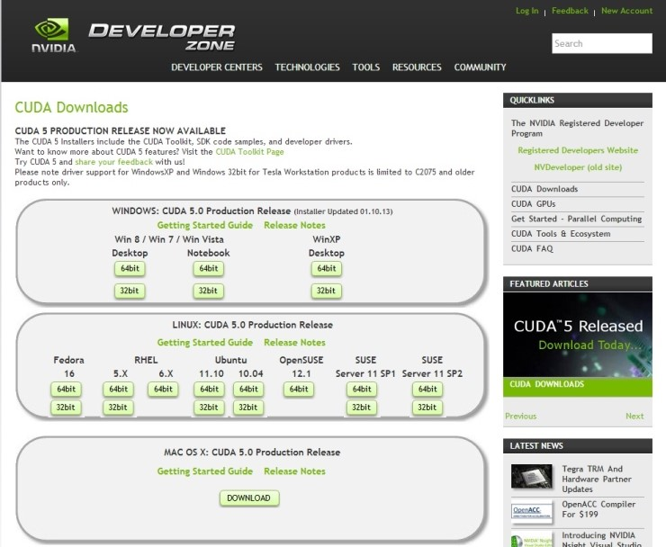
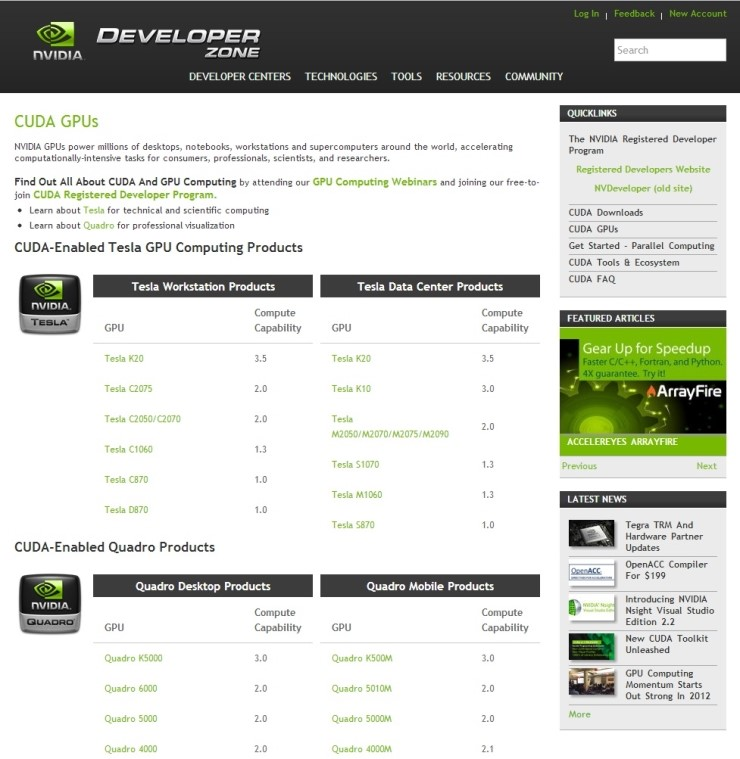

> ※ 이 글은 2013년도에 작성된 글입니다.
> 사진이나 세부적인 내용은 지금과 다를 수 있습니다.

CUDA 5.0은 이전 버전들과는 달리 설치가 매우 간편해진 것이 특징입니다. NVIDIA 사이트에서 CUDA ZONE을 들어가면 영어로 된 developer zone이 나오는데, 여기서 [CUDA Download](https://developer.nvidia.com/cuda-downloads)를 클릭해 들어가면 다음과 같은 페이지가 뜹니다.

참고로, NVIDIA Korea 사이트에서는 한글 번역을 지원해주지만 developer zone은 한글 번역을 지원해주지 않습니다. 또, 한국 사이트에서는 낮은 버전의 CUDA를 다운받게 되므로 꼭 원래 사이트에 들어가서 다운 받아 주세요.

여기서 Desktop/Notebook의 OS 등에 맞는 파일을 클릭하여 다운 받을 수 있습니다. CUDA 5.0부터는 CUDA Toolkit과 SDK code samples, developer driver를 모두 한꺼번에 다운 받아 설치할 수 있어 무척이나 간편하게 설치할 수 있게 되어 있습니다. 다운 받은 installer를 실행하면 설치가 끝납니다. 설치가 끝나면 컴퓨터를 리부팅해야 CUDA를 사용할 수 있습니다.

자신의 GPU가 CUDA 가속을 지원하는 지에 대해서는 CUDA ZONE에서 [CUDA GPUs](https://developer.nvidia.com/cuda-gpus)를 들어가면 확인할 수 있습니다. Tesla, Quadro, NVS, GeForce 순으로 나와 있습니다. 현재는 대부분의 GPU들이 CUDA 가속을 지원합니다.

한 가지 더. CUDA를 사용하기 위해서는 그래픽 드라이버가 최신 버전이어야 합니다. [NVIDIA 사이트](https://www.nvidia.co.kr/Download/index.aspx?lang=kr)에서 다운 받을 수 있으니 최신 버전인지를 확인하고 업데이트 하도록 합시다. 혹시 이후에 실행을 시켰는데 되지 않는다면 그래픽 드라이버가 최신 버전이 아니기 때문일 수도 있습니다.

자, 이렇게 CUDA 5.0을 설치하여 사용할 준비가 끝났습니다. CUDA 5.0에서는 다양한 예제 파일들을 같이 다운 받았기 때문에 그것들을 실행시켜 볼 수 있습니다. 예제 파일의 실행에 대해서는 다음 포스팅 때 이야기하도록 하겠습니다.
